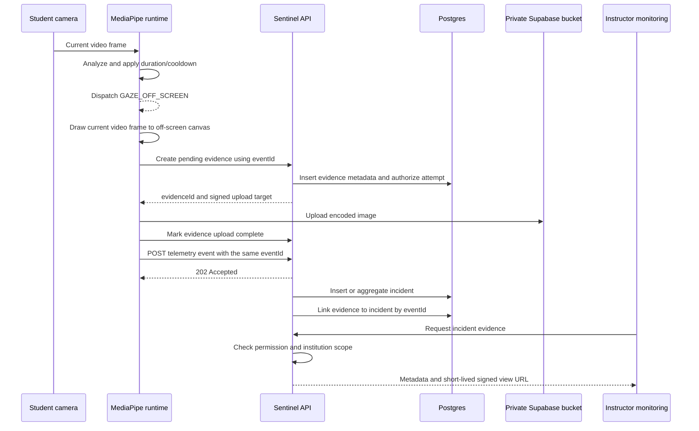

# MediaPipe Incident Evidence Capture

**Status:** Proposed design  
**Scope:** Student attempt monitoring, instructor monitoring, telemetry incidents, and Supabase Storage  
**Primary use case:** Automatically retain a camera frame when MediaPipe emits a reviewable signal such as `GAZE_OFF_SCREEN`

## Decision summary

The feature is feasible with the current architecture.

MediaPipe should remain responsible for analyzing the student camera stream. When the existing
MediaPipe runtime decides that a signal has crossed its duration/confidence threshold and is ready
to be emitted, the student browser can copy the current `<video>` frame to an off-screen canvas,
encode it as JPEG or WebP, and upload it as incident evidence.

The capture must occur on the **student device**, where the camera stream already exists. The
instructor monitoring page cannot retrieve an arbitrary historical frame from MediaPipe because
MediaPipe produces landmarks and classifications, not stored images.

Recommended product decisions:

- Rename the concept from **Capture Frame** to **Incident Evidence**.
- Capture one image for each accepted MediaPipe dispatch, not for every analyzed frame.
- Store images in a dedicated **private** Supabase bucket.
- Introduce a first-class evidence record instead of relying only on
  `flagged_incidents.evidence_url`.
- Expose evidence through incident-scoped API routes and short-lived signed view URLs.
- Allow an authorized instructor to delete evidence immediately after review.
- Also run automatic expiry cleanup, with a seven-day policy.
- Keep incident metadata after image deletion so the audit trail still records that evidence
  existed and why it was removed.

## Current implementation assessment

The repository already contains most of the boundaries needed by this feature:

- `useMediapipeCameraRuntime()` owns the student `<video>` element, MediaPipe analysis loop, signal
  duration tracking, and telemetry dispatch.
- MediaPipe currently emits `GAZE_OFF_SCREEN`, `NO_FACE_DETECTED`, and `MULTIPLE_FACES`.
- `POST /telemetry/events` accepts events asynchronously and may buffer them before an incident row
  exists.
- `flagged_incidents` already has an optional `evidence_url` column.
- Monitoring response mapping exposes that value as both `snapshotUrl` and `evidenceUrl`.
- Instructor incident cards contain snapshot-related UI, but currently render a placeholder rather
  than the actual image.
- The **Capture Frame** button in both monitoring headers has no click handler.
- The API already has `incidents:view` and `incidents:review` authorization boundaries.
- The backend already uses private Supabase Storage and short-lived signed URLs for PDF artifacts,
  so evidence can follow the same storage practices.

The current `evidence_url` column is not sufficient for the proposed workflow:

1. Telemetry ingestion is asynchronous, so the client usually does not receive an `incident_id`
   when it emits the signal.
2. Several events can be aggregated into one `flagged_incidents` row, while each occurrence may
   need its own image.
3. A signed Supabase URL expires and therefore must not be stored as the durable evidence identity.
4. Immediate deletion, automatic expiry, upload failure, and audit state cannot be represented by
   a URL alone.

## Terminology

- **Detection frame:** A camera frame analyzed locally by MediaPipe. It is not stored by default.
- **Signal:** A classified result such as `GAZE_OFF_SCREEN`.
- **Dispatch:** A signal that has crossed the client threshold/cooldown and is sent to telemetry.
- **Incident:** The backend review record in `flagged_incidents`. Multiple dispatches can aggregate
  into one incident.
- **Evidence:** A bounded, intentionally captured image associated with one dispatched event and,
  after persistence, an incident.

## Proposed workflow



Uploading evidence and telemetry may be started concurrently after the frame is encoded. The
workflow must tolerate either one finishing first. A shared client-generated `eventId` is the
correlation key.

### Trigger location

The capture belongs inside the `dispatch.shouldEmit && telemetrySignal` branch of
`useMediapipeCameraRuntime()`, immediately after the accepted analysis is known and before the next
animation frame.

Do not capture:

- on every `requestAnimationFrame`;
- while a signal is only waiting for its duration threshold;
- for disabled exam rules;
- while attempt monitoring is suspended or the attempt is no longer eligible;
- again for a retry carrying the same `eventId`;
- when the evidence quota or storage policy disables capture.

This gives the instructor evidence for the frame closest to the actual accepted detection without
turning monitoring into continuous recording.

### Frame encoding

Recommended client behavior:

1. Read `video.videoWidth` and `video.videoHeight`.
2. Scale down to a configurable maximum dimension while preserving aspect ratio.
3. Draw the current video frame onto an in-memory canvas.
4. Encode with `canvas.toBlob()` as `image/webp` or `image/jpeg`.
5. Reject an empty blob or a blob above the server limit.
6. Upload the binary blob; never put base64 image data in telemetry JSON.
7. Release the canvas/blob references after upload.

Canvas encoding also avoids carrying camera-file EXIF metadata. Evidence should contain the raw
camera image only. If landmark or gaze details are useful to reviewers, preserve them as structured
incident metadata instead of permanently drawing an overlay that could be mistaken for source
pixels.

The capture is automatic in the background of the **attempt UI**, meaning it needs no student or
instructor click. It is not a way to bypass browser camera permission, the operating-system camera
indicator, or privacy disclosure. Browser background-tab throttling and suspended camera tracks
can still prevent a useful capture.

## Evidence data model

Add a dedicated table, for example `telemetry_incident_evidence`.

| Field                      | Purpose                                                                               |
| -------------------------- | ------------------------------------------------------------------------------------- |
| `evidence_id`              | Server-generated UUID primary key                                                     |
| `attempt_id`               | Owning exam attempt; cascade on permanent attempt deletion                            |
| `incident_id`              | Nullable link to `flagged_incidents` until telemetry persistence resolves             |
| `institution_id`           | Explicit tenant scope for authorization and cleanup                                   |
| `student_id`               | Student identity used for upload ownership checks                                     |
| `event_id`                 | Client-generated UUID shared with telemetry; unique per attempt                       |
| `event_type`               | Expected MediaPipe event type                                                         |
| `captured_at`              | Client capture time, bounded/validated against server time                            |
| `received_at`              | Server time when evidence initialization was accepted                                 |
| `storage_bucket`           | Private bucket name                                                                   |
| `storage_path`             | Durable object path; never a signed URL                                               |
| `mime_type`                | Allow-listed encoded image type                                                       |
| `size_bytes`               | Verified object size                                                                  |
| `sha256`                   | Optional integrity/deduplication hash                                                 |
| `state`                    | `PENDING_UPLOAD`, `AVAILABLE`, `DELETE_PENDING`, `DELETED`, `FAILED`, or `EXPIRED`    |
| `expires_at`               | Server-calculated retention deadline                                                  |
| `reviewed_at`              | Optional time an instructor completed review                                          |
| `deleted_at`               | Object deletion time                                                                  |
| `deleted_by`               | Nullable user ID; null for automatic expiry                                           |
| `deletion_reason`          | `INSTRUCTOR_REVIEW`, `RETENTION_EXPIRED`, `ATTEMPT_DELETED`, or reconciliation reason |
| `created_at`, `updated_at` | Operational timestamps                                                                |

Recommended constraints and indexes:

- unique `(attempt_id, event_id)`;
- index `(incident_id, state)`;
- index `(state, expires_at)` for cleanup;
- index `(institution_id, created_at)` for tenant-scoped operations;
- validate allowed MediaPipe `event_type` values at the API boundary;
- allow at most one object per evidence row and never accept a client-provided bucket/path.

`flagged_incidents.evidence_url` may remain temporarily for compatibility, but new code should read
the evidence relation. A single URL field should not be the source of truth.

### Aggregated incidents

When a later signal is aggregated into an existing incident, link the new evidence row to that same
`incident_id`. The monitoring UI should show an evidence count and a small chronological gallery
rather than overwriting the previous image.

An independent quota prevents one noisy incident from producing unlimited files. A reasonable
starting policy is:

- one evidence image per emitted MediaPipe event;
- reuse the current MediaPipe cooldown;
- a configurable maximum per event type and per attempt;
- once the quota is reached, continue emitting telemetry without an image and record
  `EVIDENCE_QUOTA_REACHED` in bounded diagnostics.

The final limits should be chosen using measured image sizes and expected class volume.

## API route design

“Evidence” is a good domain name, but routes should stay nested under telemetry incidents so their
authorization and meaning are unambiguous.

### Student upload routes

#### `POST /telemetry/evidence/uploads`

Initializes one upload.

Request:

```json
{
    "attemptId": "uuid",
    "eventId": "uuid",
    "eventType": "GAZE_OFF_SCREEN",
    "capturedAt": "2026-07-27T10:30:00.000Z",
    "mimeType": "image/webp",
    "sizeBytes": 128400
}
```

The server must verify that:

- the authenticated user is the attempt owner;
- the attempt is active and monitoring is eligible;
- the event type is enabled for the exam;
- capture time is within an allowed clock-skew/window;
- MIME type, declared size, quota, and rate limits are valid;
- `(attempt_id, event_id)` is idempotent.

Response:

```json
{
    "data": {
        "evidenceId": "uuid",
        "uploadUrl": "short-lived signed upload target",
        "uploadToken": "provider token when required",
        "expiresAt": "2026-08-03T10:00:00.000Z"
    }
}
```

The storage path should be generated by the server, for example:

```text
{institutionId}/{examId}/{attemptId}/{eventId}.webp
```

#### `POST /telemetry/evidence/{evidenceId}/complete`

Marks a direct upload complete only after the server verifies that the private object exists and
matches the expected type/size. This route should be idempotent.

An API-proxied multipart upload is a valid simpler first implementation, but it sends every image
through the API process. Signed direct upload reduces API memory and network load at the cost of a
two-step state machine.

### Instructor routes

#### `GET /telemetry/incidents/{incidentId}/evidence`

Returns evidence metadata and a short-lived signed view URL for each available image. It must
enforce `incidents:view` plus the existing institution/department/course scope used by incident
queries.

Signed URLs should be generated only on demand, expire after a few minutes, and never be persisted
in the database or logs.

#### `DELETE /telemetry/evidence/{evidenceId}`

Immediately deletes the storage object after an authorized instructor confirms the action. The
operation should:

1. verify tenant and incident access;
2. require `incidents:review` initially or, preferably, a new explicit
   `incidents:delete_evidence` permission;
3. transition the row to `DELETE_PENDING`;
4. delete the object from Supabase Storage;
5. transition the row to `DELETED`, clear storage coordinates, and record actor/reason/time;
6. emit an audit log without recording a signed URL or image bytes.

If storage deletion fails, retain `DELETE_PENDING` and retry through cleanup/reconciliation. Do not
claim success while the object still exists.

### Manual “Capture Frame” behavior

The existing instructor button cannot directly capture the student's local MediaPipe video.

There are two valid product options:

1. **Recommended first release:** replace the inactive button with **View Evidence** or remove it.
   Automatic evidence appears beside each incident.
2. **Later manual capture:** send an authenticated, audited capture request through the existing
   student signaling channel. The active student page captures its local frame and uses the same
   upload workflow with a `captureSource` such as `INSTRUCTOR_REQUEST`. The request must expire
   quickly and must not work after the attempt ends.

Capturing a frame from an active LiveKit viewer is another possible implementation, but it only
works while a live inspection stream is connected and would not solve historical incident
evidence.

## Supabase Storage design

Create a dedicated private bucket such as:

```text
sentinel-proctoring-evidence
```

Requirements:

- `public = false`;
- allow only the selected image MIME types;
- apply a conservative per-object size limit;
- use a server-created path;
- use the service role only in the API;
- issue narrowly scoped, short-lived upload/view URLs;
- do not expose bucket listing to student or instructor clients;
- do not store permanent public URLs;
- do not log image bytes, signed URLs, upload tokens, or face landmarks.

Storage access alone is not authorization. The API must validate the authenticated attempt or
incident scope before issuing every signed operation.

## Seven-day retention and cleanup

The phrase “seven days from the exam start date” needs an exact rule because late attempts,
makeups, and long exam windows can otherwise expire before review.

### Retention choices

| Policy                        | Calculation                                                                                                      | Tradeoff                                                                              |
| ----------------------------- | ---------------------------------------------------------------------------------------------------------------- | ------------------------------------------------------------------------------------- |
| Strict scheduled-start policy | `exam.scheduled_date + 7 days`                                                                                   | Matches the stated rule, but late/makeup evidence may have little or no review window |
| Capture-based policy          | `captured_at + 7 days`                                                                                           | Every image receives a full week, but an exam can retain images for longer overall    |
| Recommended attempt policy    | `max(exam.end_date_time, attempt.completed_at, attempt.started_at, captured_at) + 7 days` using available values | Gives instructors a predictable post-attempt review window and handles late attempts  |

If policy approval requires the strict scheduled-start interpretation, use it explicitly and block
new evidence creation after its deadline. Otherwise, use the recommended attempt policy.

### Cleanup job

Run an authenticated cleanup job at least daily:

1. claim a bounded batch of `AVAILABLE` rows with `expires_at <= now()`;
2. transition them to `DELETE_PENDING`;
3. delete the corresponding private objects;
4. mark successful rows `EXPIRED`;
5. clear `storage_bucket` and `storage_path`;
6. retain minimal audit metadata;
7. retry failures with bounded backoff and alert on repeatedly stuck rows.

The job must be idempotent. Supabase “object not found” should be treated as successful convergence
when the matching row is expired/deleted.

Also reconcile:

- `PENDING_UPLOAD` rows older than a short upload timeout;
- objects that exist without a database record;
- database rows marked `AVAILABLE` whose objects are missing;
- evidence left unlinked because telemetry was rejected or never flushed.

Immediate instructor deletion and automatic retention should call the same deletion service so
their state transitions and audit behavior cannot drift.

## Monitoring UI changes

For each incident:

- show an evidence thumbnail only after a signed view URL is loaded;
- open the full image in an accessible dialog;
- display capture time, event type, and evidence sequence such as “2 of 3”;
- show explicit states for upload pending, unavailable, expired, and deleted;
- offer **Delete evidence** only to an authorized reviewer;
- require confirmation because deletion is irreversible;
- refresh the monitoring query after deletion;
- never describe the image as proof that cheating occurred.

The evidence is context for human review. A MediaPipe flag and its image can still be a false
positive caused by lighting, camera position, accessibility needs, another person passing in the
background, or model uncertainty.

## Failure behavior

Evidence capture must not block the exam or suppress telemetry.

| Failure                          | Required behavior                                                    |
| -------------------------------- | -------------------------------------------------------------------- |
| Canvas encoding fails            | Emit telemetry; record bounded client diagnostics                    |
| Evidence initialization fails    | Emit telemetry; retry only within a small bounded budget             |
| Supabase upload fails            | Emit telemetry; mark evidence failed/pending for reconciliation      |
| Telemetry ingestion fails        | Retain pending evidence briefly, then purge if it cannot be linked   |
| Incident worker is delayed       | Link later by `eventId`                                              |
| Evidence quota reached           | Emit telemetry without an image                                      |
| Camera frame is unavailable      | Emit telemetry without an image                                      |
| Instructor deletes while viewing | Revoke future access; allow the current signed URL to expire quickly |
| Cleanup partially fails          | Keep `DELETE_PENDING`, retry, and surface an operational metric      |

## Privacy, security, and accessibility requirements

Camera evidence is sensitive student data and materially changes the existing monitoring privacy
profile. Before rollout:

- update the pre-exam privacy disclosure to state that flagged camera frames may be retained;
- obtain institution policy/privacy approval for purpose, access roles, retention, and deletion;
- document whether a student can request access or deletion under applicable policy;
- restrict viewing to assigned/authorized staff;
- audit view, manual capture request, and deletion actions;
- do not use evidence for facial recognition or identity inference;
- do not include the exam screen or answers in the image;
- do not silently expand this feature into audio/video recording;
- provide non-image descriptions/status text so the monitoring UI remains usable without relying
  only on thumbnails.

## Capacity and performance

Evidence changes telemetry from small JSON events to binary storage traffic. Estimate before
enabling it globally:

```text
storage per exam =
    students × average captured images per student × average encoded image size
```

Example only: `1,000 students × 5 images × 150 KiB` is approximately `732 MiB` before retries and
storage overhead.

Measure:

- encoding time and main-thread impact on low-end devices;
- average and p95 image size;
- upload success/failure by connection type;
- evidence per attempt and per event type;
- time from detection to evidence availability;
- unlinked evidence count;
- delete/expiry backlog;
- Supabase storage and egress cost.

Encoding should be deferred only enough to avoid jank; the captured pixels must still correspond
to the accepted detection. Do not pause MediaPipe while awaiting network upload.

## Delivery plan

### Phase 1: Contract and storage foundation

- Add the evidence table, states, indexes, and migration.
- Add the private Supabase bucket configuration and environment variables.
- Extend MediaPipe telemetry metadata creation to include stable `eventId`, `dedupeKey`, and
  `clientActionAt`.
- Add evidence initialization/completion, list, signed-view, and deletion routes.
- Add an idempotent storage/deletion service and tenant-scoped authorization tests.

### Phase 2: Automatic MediaPipe capture

- Extract a tested utility that converts the current video frame to a bounded blob.
- Trigger it only from accepted MediaPipe dispatches.
- Upload with the same `eventId` used by telemetry.
- Add quotas, cooldown behavior, failure diagnostics, and retry limits.
- Ensure telemetry still emits when capture/upload fails.

### Phase 3: Persistence correlation

- Link evidence by `(attempt_id, event_id)` when an incident is inserted or aggregated.
- Reconcile evidence that arrives before or after the telemetry worker.
- Return evidence metadata in instructor monitoring/detail queries.
- Preserve multiple images for aggregated incidents.

### Phase 4: Instructor review UI

- Replace placeholder snapshots with actual signed images.
- Add full-size dialog, gallery state, deletion confirmation, and expired/deleted states.
- Replace or remove the inactive **Capture Frame** button.
- Add manual requested capture only if it receives separate product/privacy approval.

### Phase 5: Retention and rollout

- Implement the scheduled expiry/reconciliation job.
- Add metrics, alerts, and an operational runbook.
- Validate privacy copy and permissions.
- Roll out behind an institution/exam feature flag.
- Start with a low evidence quota and increase only after device and storage measurements.

## Required tests

### Student client

- captures exactly once for one accepted `GAZE_OFF_SCREEN` dispatch;
- does not capture while the duration threshold is pending;
- supports `NO_FACE_DETECTED` and `MULTIPLE_FACES`;
- does not capture disabled rules, cooldown duplicates, or suspended attempts;
- preserves the same `eventId` across evidence and telemetry;
- emits telemetry when encoding or upload fails;
- respects size, type, attempt, and event quotas;
- does not acquire a second camera stream.

### API and persistence

- rejects uploads for another student's attempt;
- rejects inactive attempts, mismatched event types, oversized files, and invalid MIME types;
- makes initialization and completion idempotent;
- links evidence when it arrives before and after incident persistence;
- attaches later evidence to an aggregated incident without overwriting earlier evidence;
- scopes signed viewing to authorized institution/instructor access;
- prevents permanent/public URL exposure;
- makes instructor delete and retention delete idempotent;
- retains auditable deletion metadata and clears storage coordinates;
- reconciles stale pending uploads and missing/orphan objects.

### Browser and operational validation

- Chrome, Edge, Firefox, and Safari where supported;
- foreground and throttled/background-tab behavior;
- low-bandwidth and temporary offline recovery;
- low-end device encoding impact;
- camera continuity with MediaPipe and LiveKit inspection;
- seven-day expiry in a shortened non-production test window;
- zero private objects remaining after verified deletion.

## Acceptance criteria

The feature is ready when:

- an accepted MediaPipe signal produces at most one correlated evidence image;
- the image becomes visible beside the correct instructor incident;
- aggregated incidents retain their separate evidence images;
- telemetry remains functional when evidence fails;
- no student can upload to or read from another attempt;
- no instructor can view evidence outside their authorized scope;
- evidence is stored only in a private bucket and viewed through short-lived signed URLs;
- immediate deletion removes the object and records an audit state;
- automatic cleanup removes expired objects and is safe to retry;
- the monitoring UI clearly distinguishes a flag from a confirmed violation;
- privacy disclosure and retention policy have been approved.

## Recommendation

Proceed with automated evidence capture as a separate, failure-isolated companion to telemetry.
Use the existing MediaPipe dispatch as the trigger, a stable `eventId` as the asynchronous
correlation key, a dedicated evidence table for one-to-many incident images, and a private Supabase
bucket with server-authorized signed access.

For retention, prefer seven days after the effective attempt end rather than seven days after the
scheduled exam start. If the organization requires the scheduled-start rule, encode that exact
choice in `expires_at`, configuration, tests, UI copy, and the cleanup runbook.
